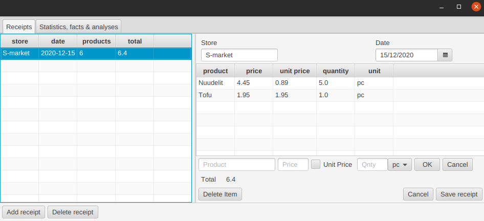

# Ostosten seurantasovellus

Sovelluksen avulla voi seurata tekemiään ostoksia ja niihin käyttämäänsä rahaa. Käyttäjä voi syöttää ohjelmaan kuitin ostoksistaan, ja ohjelmalla voi luoda yhteenvedon ostetuista tuotteista.

## Dokumentaatio
[Käyttöohje](dokumentaatio/kayttoohje.md)

[Vaatimusmäärittely](dokumentaatio/vaatimusmaarittely.md)

[Arkkitehtuurikuvaus](dokumentaatio/arkkitehtuuri.md)

[Testausdokumentti](dokumentaatio/testaus.md)

[Työaikakirjanpito](tyoaikakirjanpito.md)

## Komentorivikomennot 

### Ajaminen
- komennolla `mvn compile exec:java -Dexec.mainClass=receiptapp.Main`

### Testaus
- Testit suoritetaan komennolla `mvn test`
- Testikattavuusraportti luodaan komennolla `mvn jacoco:report`
- Kattavuusraporttia voi tarkastella tiedostosta *target/site/jacoco/index.html*

*Huom!* Jostain syystä testit näyttävät välillä DAO-luokan rivi- ja haarautumiskattavuudeksi 0%, vaikka tälle on tehty testit. Ongelma ratkeaa usein ajamalla `mvn clean` ja tämän jälkeen `mvn test jacoco:report`.

### Checkstyle
- Checkstyle-raportti luodaan komennolla `mvn jxr:jxr checkstyle:checkstyle`
- Raportti löytyy */target/site/checkstyle.html*

### jar-paketin luominen
- jar-tiedosto luodaan komennolla `mvn package`. Tämä luo .jar-tiedoston kansioon *target*
- ohjelman suoritetaan jar:na komennolla `java -jar Kuittitietokanta-1.0-SNAPSHOT.jar`

### Releaset
- [Viikon 5 versio](https://github.com/serepo/ot-harjoitustyo/releases/tag/viikko5)
- [Lopullinen versio](https://github.com/serepo/ot-harjoitustyo/releases/tag/loppupalautus)