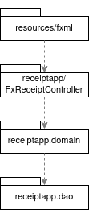
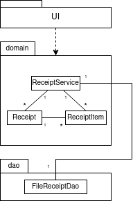
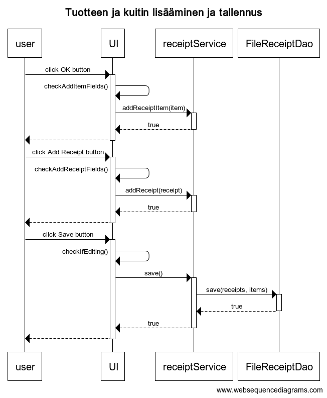

 # Arkkitehtuurikuvaus

 ## Rakenne
 Ohjelman rakenne noudattaa seuraavaa pakkausrakennetta:
 
 

 ## Käyttöliittymä
 Käyttöliittymä koostuu käytännössä yhdestä näkymästä, joka on kuitenkin jaettu kahteen alinäkymään välilehtien avulla. Näkymä on toteutettu yhtenä Scene-oliona, joka on rakennettu käyttäen SceneBuilderia.

 Sovelluslogiikka on eriytetty käyttöliittymästä seuraavasti:
 Käyttöliittymän rakentava fxml-koodi on resources-kansiossa olevassa fxml-paketissa, ja käyttöliittymän toiminnallisuudet toteuttava luokka ReceiptController kutsuu sovelluslogiikasta vastaavaa receiptService-oliota.

 ## Sovelluslogiikka

 Sovelluslogiikasta vastaa luokan ReceiptService olio, joka toteuttaa käyttöliittymän toiminnallisuudet. Näitä ovat esimerkiksi kuitin tallennus, muokkaus ja poisto.
 ReceiptService pääsee käsiksi tallennettuun tietoon FileReceiptDao-luokan attribuutin avulla.

 Ohjelman osien suhdetta kuvaava luokkakaavio:
 
 

 ## Tietojen pysyväistallennus
 
 Tietojen pysyväistallennuksesta vastaa dao-pakkauksen tiedosto FileReceiptDao. Tiedot tallennetaan käyttämällä sqlite-tietokantaa.

 ## Päätoiminnallisuudet
 
 Sovelluksen merkittävin päätoiminnallisuus on mahdollisuus luoda ja tallentaa kuitteja. Koska tuotteita ei voi lisätä sovellukseen ilman kuittia, tuotteiden käsittely ja muokkaus palautuu lopulta kuitin lisäämiseen ja muokkaamiseen.

 Tilanne, jossa käyttäjä lisää uuden tuotteen kuitille, luo tämän jälkeen kuitin ja tallentaa tiedoston, etenee sovelluksessa seuraavasti:

 

 ## Ohjelman rakenteeseen jääneet heikkoudet ja ongelmat
 
 ### Käyttöliittymä
 Tuotteiden kokonaishinta jää välillä päivittymättä. Lisäksi jos olemassa olevan kuitin itemiä muokkaa ja painaa item-rivin perässä olevaa ok-painiketta, mutta tämän jälkeen peruukin kuitin muokkauksen, itemin muokkaus tallentuu tästä huolimatta.

 ### DAO-luokka
 FileReceiptDao on ehkä tarpeettoman suuri luokka, ja osa sen metodeista sisältää jonkin verran toisteista koodia. Osan luokan metodeista voisi myös jakaa vielä useammaksi eri metodiksi.

 Tietokantatiedosto luodaan siihen kansioon, jossa ohjelma ajetaan, ja sen nimi on kovakoodattu sovellukseen. Jos ohjelma ajetaan kansiossa, johon ei kirjoitusoikeutta, tietokantatiedoston luominen ei onnistu ja se saa aikaan virheen joka ei välttämättä näy käyttäjälle.