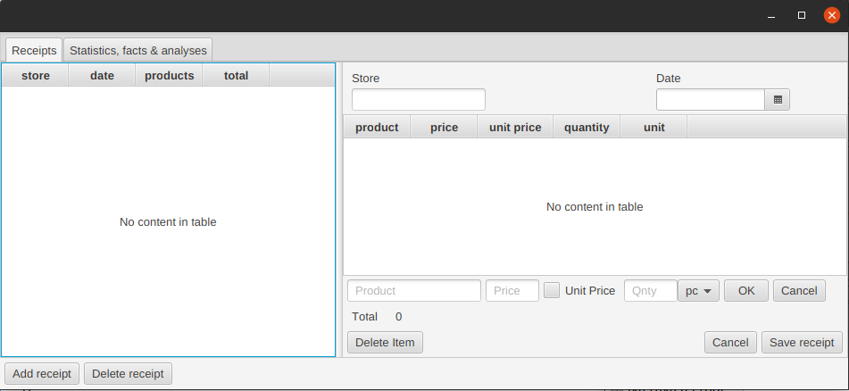
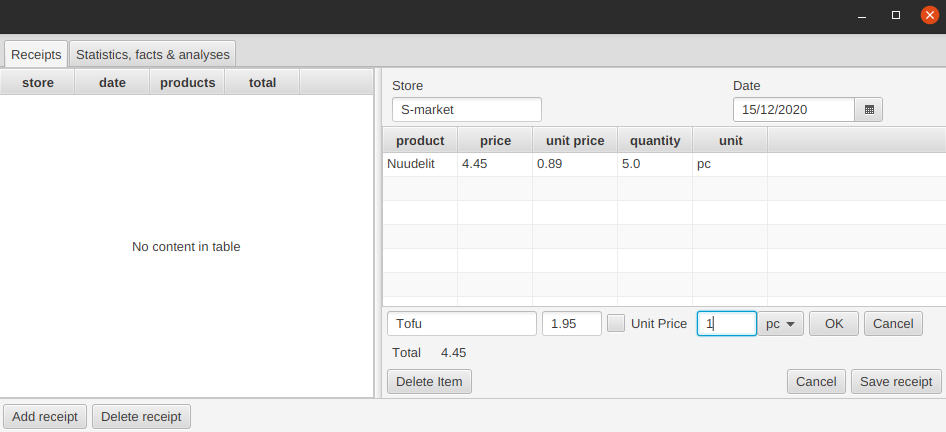
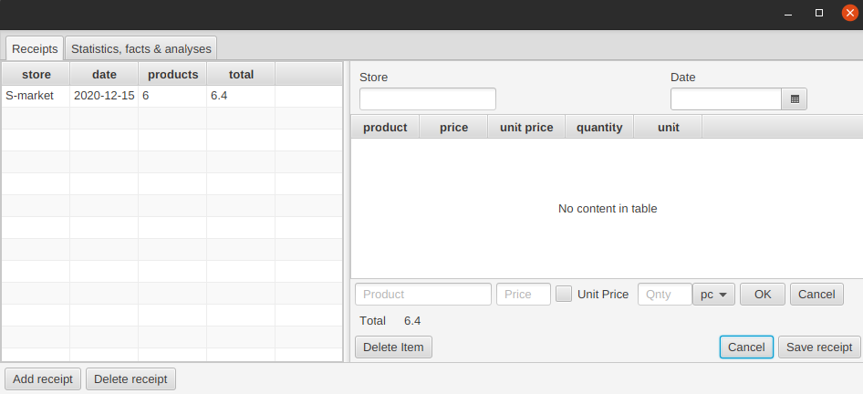
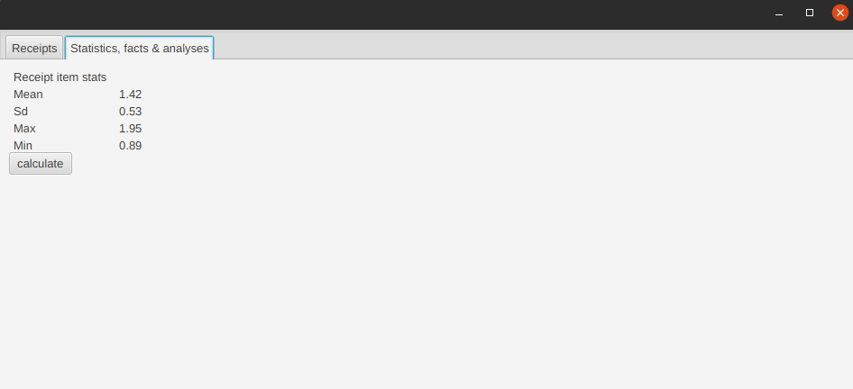

# Käyttöohje

Lataa sovelluksen .jar-tiedosto [täältä](https://github.com/serepo/ot-harjoitustyo/releases/tag/loppupalautus). Tämän jälkeen ohjelman voi käynnistää komennolla `java -jar receiptapp.jar`.

Sovellusta käytetään nappeja painelemalla.

## Kuittivälilehti

Ensiksi avautuu kuittinäkymä:

Kuitin voi lisätä täyttämällä oikealla puolella olevat tarvittavat kentät. Tuotteita lisätään kuitille täyttämällä tuotteen tiedot tuotetaulukon alla oleviin tekstikenttiin ja painamalla *OK*:

Painamalla *Save receipt* kuitti tallentuu vasemmalla puolella olevaan kuittitaulukkoon. 

Sen voi valita uudelleen tuotteineen tarkasteltavaksi, jolloin sen tuotteita voi tarkastella ja muokata. Tuotteen muokkaus tallennetaan painamalla *OK* ja kuitin muokkaus painamalla *Save receipt*.
Painamalla *Add receipt* tyhjentyvät valittuna olevan kuitin tiedot oikealla olevasta näkymästä, jolloin pääsee täyttämään uuden kuitin tietoja.

## Yhteenvetovälilehti

Toiselta välilehdeltä ei toistaiseksi löydy mitään erityisempiä yhteenvetoja. Jonkinlaisen yhteenvedon tuotteista saa laskettua painamalla *calculate*.

