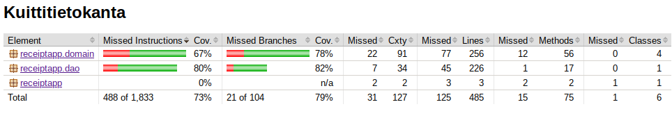

# Testausdokumentti

## YKsikkö- ja integraatiotestit

### Sovelluslogiikka
Sovelluslogiikkaa sisältävät luokat domain-pakkauksessa on testattu pääasiassa yksikkötestein, ja lisäksi testiluokat sisältävät joitain testejä, joita voisi ehkä kutsua integraatiotesteiksi.

### DAO-luokka
Sovelluksen DAO-luokka on testattu käyttäen väliaikaistallennukseen luotavaa tiedostoa.

### Testauskattavuus
Testauskattavuusraportissa ei huomioida käyttöliittymän rakentavaa koodia eli fx- tai recources-kansioiden sisältämiä tiedostoja.

Testaamatta jäi ajanpuutteen vuoksi joitain metodeja. Lisäksi DAO-luokissa testeissä on pääosin vain haarat, jotka eivät aiheuta exceptioneita.

## Järjestelmätestaus
Järjestelmätestaus on suoritettu manuaalisesti. Testauksessa on pyritty rikkomaan sovellus väärillä syötteillä ja esim. muokkaamalla tietokantatiedostoa kesken käytön.

## Sovellukseen jääneet laatuongelmat
- Integraatiotestaus ei välttämättä ole kovin laajasti toteutettu, eikä sitä ole eriytetty omaksi testiluokakseen, vaan ovat luokkien yksikkötestien seassa
- Testikattavuus voisi olla korkeampi
- Domain-pakkauksen luokka ReceiptItemin toteutus ja metodien määrä on hankaloittanut sen testaamista.
- Sovellus ei välttämättä anna kaikissa tilanteissa riittävän selkeitä virheilmoituksia, tai ne eivät päädy käyttäjälle asti. 
- Yhteenvetovälilehden kehitys jäi kesken ajanpuutteen vuoksi, eikä ole tällä hetkellä kovin järkevä