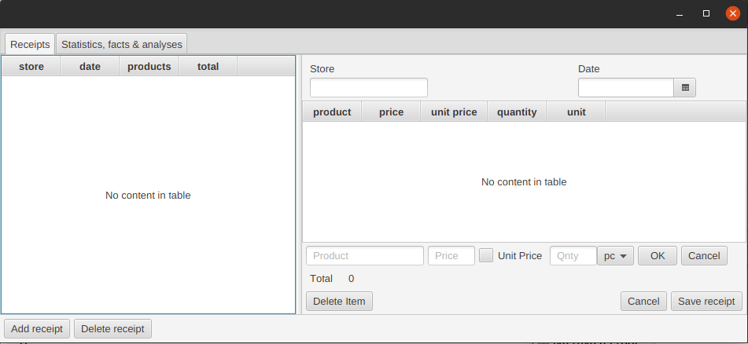

# Vaatimusmäärittely: ostosten seurantasovellus

## Sovelluksen tarkoitus ja käyttö
Sovelluksen avulla voi seurata tekemiään ostoksia ja niihin käyttämäänsä rahamäärää. Tarkoitus on pystyä tallentamaan kuitit sähköisessä muodossa ja käsitellä niissä olevia tietoja.

## Käyttöliittymä
Sovellukseen liittyy kaksi välilehtinäkymää: kuittinäkymä ja yhteenvetonäkymä.

Kuittinäkymä on jaettu kahteen osaan: 
- listausnäkymään, jossa ostokset ovat lisäysjärjestyksessä taulukossa
-  esikatselunäkymään, jossa voidaan tarkastella ja muokata kuitin sisältöä.

Esikatselunäkymässä hoituu myös uuden kuitin lisäys. Kuittinäkymässä on mahdollisuus järjestää kuitit myös summan mukaan tai rajata kuitteja päivämäärällä.
Yhteenvetonäkymässä on oletuksena viimeisen viikon aikana tehtyjen ostosten määrä, kokonaissumma ja muita tietoja ostoksista sekä niihin liittyvistä tuotteista.

## Toiminnallisuudet

### Listausnäkymä
- järjestelmään on mahdollista lisätä uusi kuitti
- kuittia ja sen sisältämiä tuotteita on mahdollista muokata
- kuitteja voi tarkastella listassa, ja ne voidaan järjestää myymälän, päivämäärän, tuotteiden määrän tai loppuhinnan mukaan
- myös tuotteita on mahdollista tarkastella kuittikohtaisesti, ja myös ne voidaan järjestää nimen, hinnan, yksikköhinnan tai määrän mukaan
- kuitti on mahdollista poistaa
- kuitilta voidaan poistaa yksittäisiä tuotteita

### Yhteenvetonäkymä
Yhteenvetonäkymässä on tällä hetkellä mahdollisuus laskea tuotteille seuraavia tunnuslukuja:
- keskiarvo
- minimi ja maksimi
- keskihajonta

## Jatkokehitysideoita
- myymälävalitsin, josta voidaan valita kuitille myymälä: myymälöitä voi lisätä, poistaa ja muokata
- enemmän yhteenvetotietoja yhteenvetonäkymään
- tuotteiden yksityiskohtaisempi tarkastelu ja parempi hallinta, jotta niistä voisi tehdä myös yhteenvetoja
- mahdollisuus merkitä kuitille maksaja, jos sovellus on käytössä useamman henkilön taloudessa
